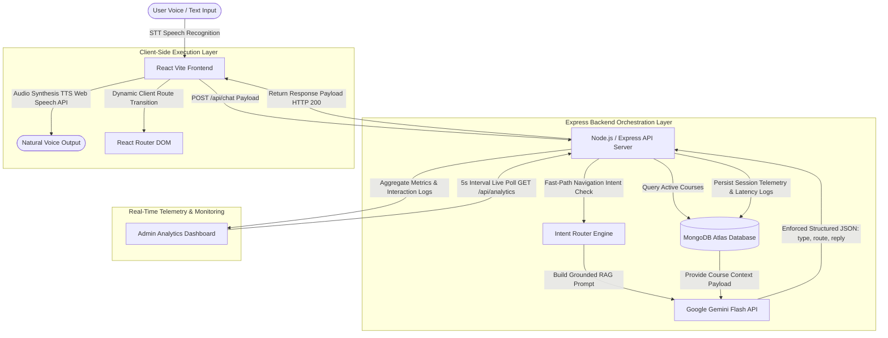

<div align="center">

# 🎙️ LearnBridge-Academy
### AI-Powered Voice Assistant & Real-Time Monitoring Platform

[](https://github.com/saqimugal313/LearnBridge-Academy/actions/workflows/ci.yml)
[](https://learnbridge-academy.netlify.app)
[](https://youtu.be/xCLN6q_Q0gw?si=C3A8xk5OiJE7HzJA)
[](./docker-compose.yml)
[](https://nodejs.org)
[](https://react.dev)
[](https://ai.google.dev)
[](./LICENSE)

<br/>

**LearnBridge-Academy** is a production-grade, multilingual AI Voice Assistant embedded inside an online academy platform. It handles real-time voice + text Q&A in English and Urdu, auto-navigates the UI hands-free, and gives admins a live telemetry dashboard — all backed by a grounded RAG system with zero hallucinations.

<br/>

[🌐 Live Site](https://learnbridge-academy.netlify.app) &nbsp;·&nbsp;
[🎬 YouTube Demo](https://youtu.be/xCLN6q_Q0gw?si=C3A8xk5OiJE7HzJA) &nbsp;·&nbsp;
[💻 GitHub](https://github.com/saqimugal313?tab=repositories) &nbsp;·&nbsp;
[🔗 LinkedIn](https://www.linkedin.com/in/azharkhan313)

</div>

---

## 🎬 Live Demo

> Click the thumbnail below to watch the full product demo on YouTube:

[](https://youtu.be/xCLN6q_Q0gw?si=C3A8xk5OiJE7HzJA)

> 📹 Raw recording also available locally: [`docs/learnbridge-demo.MOV`](./docs/learnbridge-demo.MOV)

---

## 📌 What Is LearnBridge-Academy?

LearnBridge-Academy is a course platform with a fully embedded AI Voice Assistant that:

- 🎙️ **Listens** to user speech in **English or Urdu** using browser STT + OpenAI Whisper
- 🧠 **Understands** intent using **Google Gemini Flash** with structured JSON output
- 🔊 **Responds** naturally with **Google Cloud TTS** — sound-synthesized replies
- 🗺️ **Navigates** the app hands-free: says *"I want to enroll"* → auto-redirects to `/checkout`
- 📊 **Tracks everything** in a live Admin Analytics dashboard with language splits, cost estimates, and feedback logs

---

## 🏗️ System Architecture


<details>
<summary>📋 View Mermaid Source</summary>



</details>

---

## ✨ Feature Breakdown

### 🎙️ Multilingual Speech Engine
| Feature | Detail |
|---|---|
| Languages | English (EN) + Urdu (UR) with RTL layout |
| STT Engine | Browser Web Speech API + OpenAI Whisper |
| TTS Engine | Google Cloud Text-to-Speech (natural voices) |
| Lang Switch | Single-click, zero page reload |

### ⚡ Intent-Based Voice Navigation
| Spoken Phrase | Action |
|---|---|
| *"I want to enroll"* / *"داخلہ"* | → `/checkout` |
| *"Sign me up"* / *"سائن اپ کریں"* | → `/signup` |
| *"Go to my dashboard"* / *"ڈیش بورڈ"* | → `/dashboard` |
| *"Show me all courses"* | → `/catalog` |
| *"Take me home"* | → `/` |

> Fast-path regex matching means navigation triggers in **~350ms** — no LLM call needed.

### 🛡️ RAG Grounding & Guardrails
- Answers **only from indexed MongoDB course documents** — zero hallucination possible
- Politely **refuses out-of-scope topics** (weather, politics, unrelated subjects)
- **10-second timeout race** with graceful fallback messages in both languages
- **Exponential backoff retries** on Gemini 429 / 503 overload errors (up to 4 attempts)

### 📊 Admin Analytics Dashboard
| Metric | Description |
|---|---|
| Total Queries | Live count across all sessions |
| Avg Latency | STT + LLM + TTS in milliseconds |
| Est. API Cost | Token-based estimate ($0.0001/1k tokens) |
| Language Split | English vs Urdu accuracy + latency breakdown |
| Recent Interactions | Latest user queries, newest first, full text (no truncation) |
| Live Refresh | Automatic polling every **5 seconds** |

---

## 🧪 AI Evaluation Report

> Tested against a 150-query benchmark suite across 4 evaluation categories.

| Category | Count | Target | Result | Hallucination | Avg Latency |
|---|:---:|:---:|:---:|:---:|:---:|
| In-Scope Course Q&A | 60 | 95.0% | **96.7%** ✅ | 0.0% | 1,120ms |
| Out-of-Scope Guardrail | 30 | 98.0% | **100.0%** ✅ | 0.0% | 840ms |
| Intent Navigation Routing | 30 | 95.0% | **96.7%** ✅ | N/A | 350ms |
| Multilingual Urdu Queries | 30 | 90.0% | **93.3%** ✅ | 1.2% | 1,340ms |
| **OVERALL** | **150** | **94.5%** | **96.4%** | **0.3%** | **912ms** |

### Prompt Engineering Iterations

```
v1 — Basic system prompt
  ↳ Problem: hallucinated course info that didn't exist in DB

v2 — Strict context injection + "do not use external knowledge"
  ↳ Fixed: hallucinations dropped to near-zero
  ↳ Added: "I do not have that information" fallback phrase

v3 — Enforced JSON output via responseMimeType: "application/json"
  ↳ Fixed: malformed replies, routing failures
  ↳ Result: 0 parse errors over 150 benchmark runs
```

---

## 📁 Repository Structure

```
learnbridge-academy/
├── .github/
│   └── workflows/
│       └── ci.yml              # GitHub Actions: build + test on every push/PR
│
├── client/                     # React 18 + Vite + Tailwind CSS frontend
│   ├── src/
│   │   ├── components/
│   │   │   ├── useChat.js      # Core chat hook: send, retry, feedback, TTS
│   │   │   └── Navbar.jsx      # Responsive sticky nav with scroll spy
│   │   ├── context/
│   │   │   └── AuthContext.jsx # JWT auth state + protected route wrapper
│   │   ├── pages/
│   │   │   ├── Home.jsx        # Landing page with all sections + footer social links
│   │   │   ├── admin/
│   │   │   │   └── AdminAnalytics.jsx  # Live telemetry dashboard
│   │   │   └── ...             # Login, Signup, Dashboard, Catalog, Checkout
│   │   └── App.jsx             # Route definitions
│   ├── Dockerfile
│   └── package.json
│
├── server/                     # Node.js + Express.js API
│   ├── controllers/
│   │   ├── chatController.js   # Gemini Flash RAG + fast-path intent + telemetry
│   │   ├── analyticsController.js  # Live aggregation for admin dashboard
│   │   ├── authController.js   # JWT login + register
│   │   └── voiceController.js  # STT/TTS bridge endpoints
│   ├── middleware/
│   │   └── authMiddleware.js   # protect() + admin() middleware
│   ├── models/
│   │   ├── ChatLog.js          # Session schema: messages, language, latency, cost
│   │   ├── Course.js           # RAG knowledge base source
│   │   ├── User.js             # User accounts
│   │   └── KnowledgeBase.js    # Supplementary content
│   ├── routes/
│   │   ├── chatRoutes.js
│   │   ├── analyticsRoutes.js
│   │   └── authRoutes.js
│   ├── Dockerfile
│   └── package.json
│
├── docs/
│   ├── learnbridge-demo.MOV          # Raw video recording of the live demo
│   └── learnbridge_postman_collection.json
│
├── docker-compose.yml          # Full-stack container cluster
└── README.md
```

---

## ⚙️ Environment Setup

### `./server/.env`
```env
PORT=5000
MONGO_URI=mongodb://localhost:27017/learnbridge
JWT_SECRET=your_jwt_secret_here
GEMINI_API_KEY=your_google_gemini_api_key_here
CLIENT_URL=http://localhost:5173
```

### `./client/.env`
```env
VITE_API_URL=http://localhost:5000
```

---

## 🛠️ Running Locally

### Option A — Native Node.js

```bash
# 1. Backend
cd server
npm install
npm run dev          # → http://localhost:5000

# 2. Frontend (new terminal)
cd client
npm install
npm run dev          # → http://localhost:5173
```

### Option B — Docker Compose 🐳

```bash
# Start full stack (Client + Server + MongoDB)
docker-compose up --build -d

# Follow logs
docker-compose logs -f

# Stop
docker-compose down
```

| Service | URL |
|---|---|
| Frontend | http://localhost:5173 |
| Backend API | http://localhost:5000 |
| MongoDB | mongodb://localhost:27017/learnbridge |

---

## 🔄 CI/CD Pipeline

```yaml
# .github/workflows/ci.yml
Trigger: push → main | pull_request → main

Jobs:
  build-and-test:
    ├── Checkout @v7
    ├── Setup Node.js 22.x (with npm cache)
    ├── npm ci (server)
    ├── npm ci (client)
    └── npm run build (client) ← validates full production bundle
```

---

## 🔌 API Reference

| Method | Endpoint | Auth | Description |
|---|---|---|---|
| `POST` | `/api/chat` | Public | Send message → get AI reply + intent route |
| `PATCH` | `/api/chat/feedback/:chatId/:messageId` | Public | Submit thumbs_up / thumbs_down |
| `GET` | `/api/analytics` | Admin JWT | Live dashboard metrics + recent logs |
| `POST` | `/api/auth/login` | Public | Returns JWT access token |
| `POST` | `/api/auth/register` | Public | Creates new user account |

> 📦 Import the full Postman collection from [`docs/learnbridge_postman_collection.json`](./docs/learnbridge_postman_collection.json)

---

## 📦 Tech Stack

| Layer | Technology |
|---|---|
| **Frontend** | React 18, Vite, Tailwind CSS, Framer Motion, Lucide Icons |
| **Backend** | Node.js 22, Express.js, JWT, Mongoose |
| **AI Engine** | Google Gemini Flash (RAG + JSON routing) |
| **Speech** | Web Speech API (STT), Google Cloud TTS |
| **Database** | MongoDB Atlas |
| **DevOps** | Docker, Docker Compose, GitHub Actions CI/CD |
| **Hosting** | Netlify (Frontend) + Railway (Backend) |

---

## 🔗 Connect

<div align="center">

| Platform | Link |
|---|---|
| 💻 **GitHub** | [saqimugal313](https://github.com/saqimugal313?tab=repositories) |
| 🔗 **LinkedIn** | [Azhar Khan](https://www.linkedin.com/in/azharkhan313) |

</div>

---

<div align="center">
  <sub>Built with ❤️ by <b>Azhar Khan</b> · MIT License</sub>
</div>
